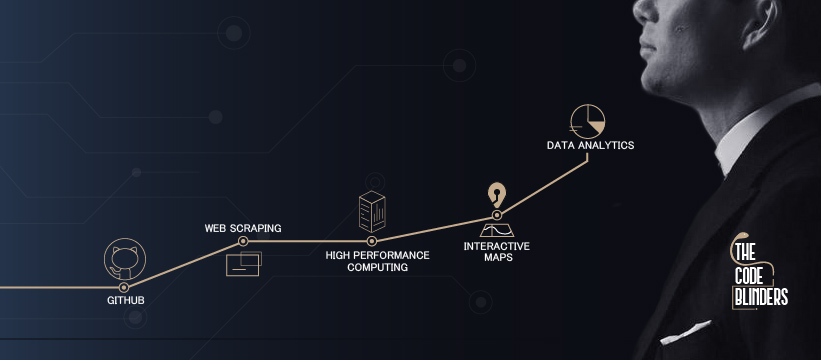

### Hi there 👋

<!--
**raulsedano2410/raulsedano2410** is a ✨ _special_ ✨ repository because its `README.md` (this file) appears on your GitHub profile.

Here are some ideas to get you started:

- 🔭 I’m currently working on ...
- 🌱 I’m currently learning ...
- 👯 I’m looking to collaborate on ...
- 🤔 I’m looking for help with ...
- 💬 Ask me about ...
- 📫 How to reach me: ...
- 😄 Pronouns: ...
- ⚡ Fun fact: ...
-->


 👋 Hi there, my name is Raul Sedano 
==
  
> ### I currently work as a research assistant. 

>### I am also a contributor to [The Code Blinders](https://www.facebook.com/The-Code-Blinders-106072675044753).  

>### I am focused on data science.  

>### My hobby is scraping web pages.  
```python
from selenium import webdriver
import scrapy
import requests
from bs4 import BeautifulSoup
```
 

